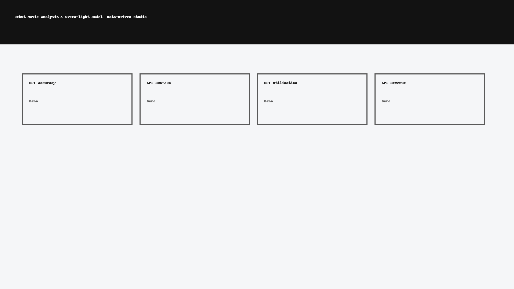

<p align="left">
  <a href="https://www.python.org/"></a>
  <a href="#"></a>
  <a href="https://github.com/emilio027/Microsoft-Film-Studios-Debut-Movie-Analysis-Recommendations/actions"></a>
  <a href="https://github.com/emilio027/Microsoft-Film-Studios-Debut-Movie-Analysis-Recommendations/commits/main"></a>
  <a href="#"></a>
</p>

[](https://colab.research.google.com/github/emilio027/Microsoft-Film-Studios-Debut-Movie-Analysis-Recommendations/blob/main/notebooks/quickstart.ipynb)




    # Debut Movie Analysis & Green-light Model — Data-Driven Studio Decisions

    ## Executive Summary
    Clean data pipeline from TMDB/OMDb + budgets for feature engineering and modeling (classification/quantile).
Produces a green-light rubric with uncertainty and practical guidance for marketing/resource allocation.

    **ATS Keywords:** Python, SQL, Power BI, Tableau, Pandas, NumPy, scikit-learn, ETL, data pipeline, automation, business intelligence, KPI dashboard, predictive modeling, time series forecasting, feature engineering, stakeholder management, AWS, GitHub Actions, Streamlit, Prophet, SARIMAX, SHAP, risk analytics, calibration, cross-validation, A/B testing

    ## Skills & Tools
    - Python
- APIs (TMDB/OMDb)
- scikit-learn
- Quantile regression
- Classification
- Feature engineering
- Power BI/Streamlit visuals

    ## Deliverables
    - Data cleaning + joins, reproducible scripts
- Baseline models and quantile regression for revenue ranges
- Visual insights and a decision rubric for executives

    ## Key Metrics / Evaluation
    - ROC-AUC / Accuracy (cls.)
- Pinball Loss (quantile)
- Top-K lift

    ## How to Run
    ```bash
    python -m venv .venv && source .venv/bin/activate
    pip install -r requirements.txt
    make data
    make report
    ```
    *Law Firm demo:* `streamlit run app.py`

    ## Impact Highlights (from my work history)
    - Saved $3M by automating workflows and migrating Excel processes to SAP HANA at NRG
- Resolved data issues saving $500k annually at CenterPoint Energy
- Improved stakeholder transparency by 15% via SQL + Power BI/Tableau dashboards at Robin Hood
- Scaled an AI automation agency from $750 to $28k weekly revenue as Founder/CEO

    ## Repo Structure
    ```
    src/  notebooks/  data/{raw,processed}  models/  scripts/  tests/  docs/img/  reports/
    ```
